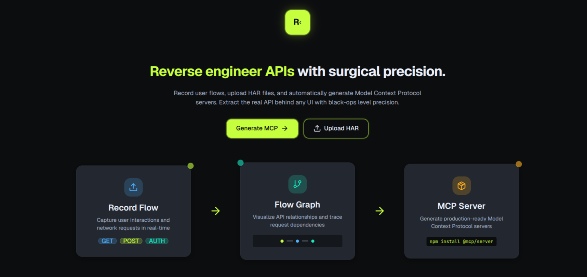

# Reverse engineer APIs with surgical precision



Record user flows, upload HAR files, and automatically generate Model Context Protocol servers. Extract the real API behind any UI with black‑ops level precision.

- Record Flow → Capture user interactions and network requests in real time
- Flow Graph → Visualize API relationships and trace request dependencies
- MCP Server → Generate production‑ready MCP servers

---

## Table of Contents

- Overview
- Architecture
- Prerequisites
- Setup
- Running the backend
- Record a HAR (optional)
- Generate an MCP server from a HAR
- Run the generated MCP server
- API reference
- Troubleshooting
- Security notes

---

## Overview

This repository contains:

- A FastAPI backend in `backend/` with an endpoint that reads a HAR file and asks Claude Code to generate a minimal, working MCP server.
- A service that streams multi‑turn Claude progress to your terminal and only returns success when the agent finishes writing files and emits the final confirmation line.
- The generated MCP server is written to `mcp/` at the repo root.

High‑level flow:
1) Capture a HAR (via our browser automation endpoint or any other tooling).
2) Call POST `/api/v1/claude/mcp/from-har` with the HAR path.
3) Inspect the generated MCP server in `mcp/` and run it.

---

## Architecture

- Backend: FastAPI (Python)
  - Route: [backend/app/api/routes/claude.py](cci:7://file:///home/newton/aws_hackathon/backend/app/api/routes/claude.py:0:0-0:0)
    - POST `/api/v1/claude/mcp/from-har`
  - Service: [backend/app/services/claude_code_service.py](cci:7://file:///home/newton/aws_hackathon/backend/app/services/claude_code_service.py:0:0-0:0)
    - Uses Claude Code SDK (via the installed CLI) to:
      - Read provided HAR files and [agent/CREATE_MCP.md](cci:7://file:///home/newton/aws_hackathon/agent/CREATE_MCP.md:0:0-0:0)
      - Write [mcp/har_api_server.py](cci:7://file:///home/newton/aws_hackathon/mcp/har_api_server.py:0:0-0:0) and `mcp/README.md`
      - Stream progress logs: assistant text, tool use, and tool results
      - Succeeds only when Claude emits: `done MCP created and running on http://127.0.0.1:<port>`
    - Defaults:
      - Tools: Read, Write, Grep, WebSearch, WebFetch (Bash optional)
      - `permission_mode`: `bypassPermissions` (no prompts)
      - `max_turns`: 20 (configurable)
- Output: [mcp/har_api_server.py](cci:7://file:///home/newton/aws_hackathon/mcp/har_api_server.py:0:0-0:0) defines a top‑level `mcp` FastMCP instance with httpx-based tools that mirror observed API endpoints.

---

## Prerequisites

- Python 3.11+
- Node.js (for Claude Code CLI)
- `uv` (recommended) or your preferred Python env manager
- Claude Code CLI:
  - `npm install -g @anthropic-ai/claude-code`
- Environment:
  - `ANTHROPIC_API_KEY` in `backend/.env`
  - If you have `ANTHOPIC_API_KEY` (typo), the backend maps it internally to `ANTHROPIC_API_KEY`.

---

## Setup

1) Install Python deps (backend):

```bash
cd backend
uv sync